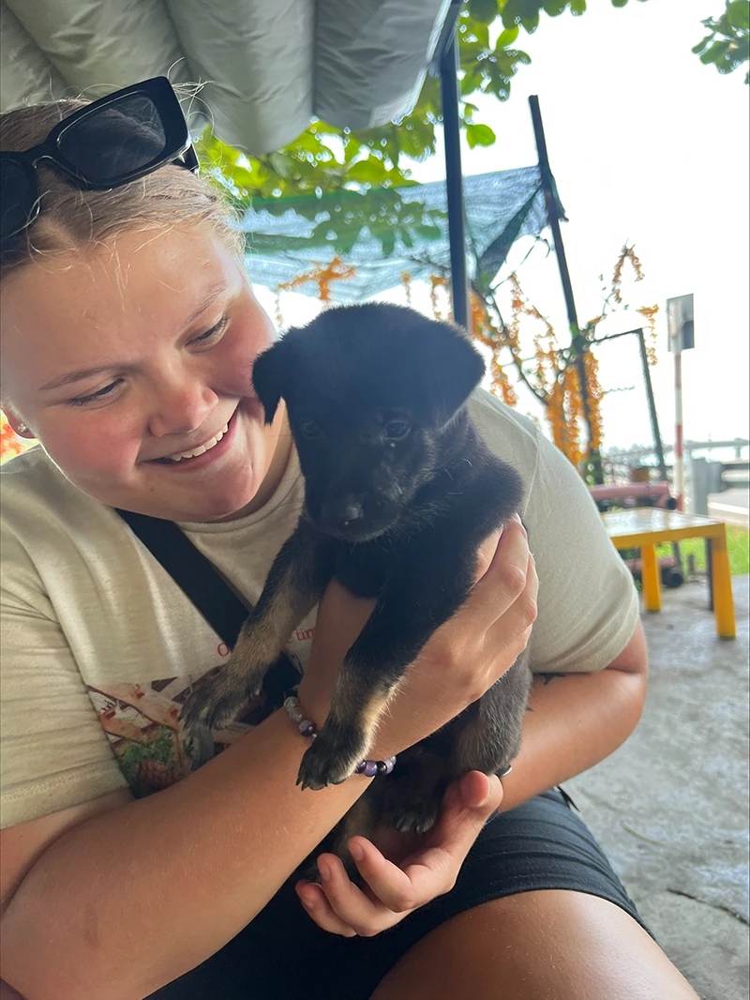

# Hi! My name is Elisabeth Trondsen 

## About me

So, to be honest it was my dream to be a Diabetic nurse when I grew up. For me growing up with diabetes I always wanted children with diabetes to come to the hospital and get a nurse that really understand what it feels like. Obviously, it did not turn out that way. After working over one year in a grocery store and then a year as a waiter while trying to find my calling in life I went on sick leave. It was then I bought my first digital painting board and started my interest in work I could to on the pc. After a shit day at work as a waiter I took a spontaneous shot and applied at Noroff front end. The next day I got the accepting letter, and I quit my job. This was almost a year ago now and the best decision in my life. Today I have my homebase in Vietnam with my boyfriend while we travel the world. And I promise you, studying is so much easier in 30 degrees and with some of the best views in the world. This year has taught me a lot, I went from seeing a black site with different colors, to making my own page. We have been through Design, HTML, CSS, JavaScript, and WordPress this year. I am really looking forward to learning more next year, but for now I`m going to enjoy the summer!  

## More about me :)

- 🔭  I’m currently working on Front-End Developer Course
- 💬 Ask me about anything and I will answer the best I can
- 📫 How to reach me: [My Facebook](https://www.facebook.com/elisabeth.trondsen.14/)
- ⚡ Fun fact, I played football for 15 years, but you know, my kne got bad. If not i would have been a professional now. 
